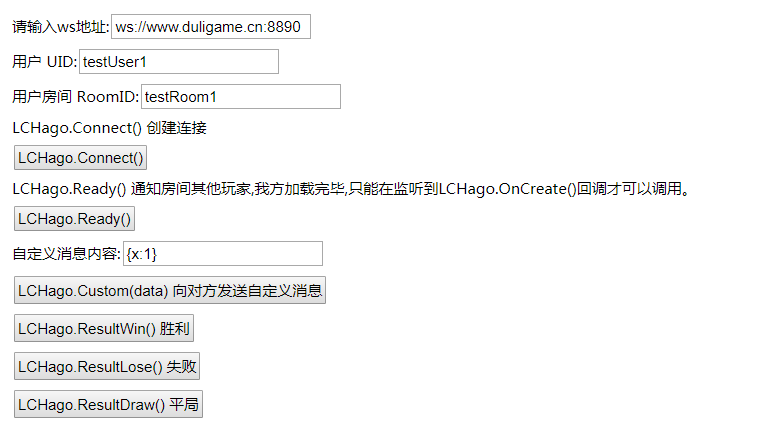

# HAGO 小游戏 SDK 文档

> 文档版本： 1.0.2
>
> 最后修改时间： 2019.02.26
>
> 编写人员： Wells, Jeremy

## 1. DEMO 及测试地址

SDK Demo 地址如下，在浏览器中可以点击相应按钮触发接口调用，开发者工具控制台可看到调用相应接口的输出。

[SDK Demo 地址： http://cdn.duligame.cn/LCHagoJS/index.html](http://cdn.duligame.cn/LCHagoJS/index.html)

需要对接的内容包括按钮中的 6 个接口和相应的监听事件。输入框中的 `ws 地址` 、 `用户 UID` 、 `用户房间 RoomID` 供测试时使用，正式环境将从服务器获取这些字段。

Demo 截图如下：



## 2. 接口说明

**对接须引入 `lchagopb.min.js` 、 `LCHago.js` 、 `LCHago.d.ts` 文件。**

### 2.1. 创建连接

1. 使用场景

需要连接服务器加入房间时调用即可。

接口调用成功后会触发以下监听回调：

* 连接成功：触发 `onWSConnect` 监听回调。
* 我放成功加入房间：触发 `onJoin` 监听回调。
* 双方均成功加入房间：触发 `onCreate` 监听回调。

2. 接口示例

```javascript
// 设置 ws 服务器地址、UID、RoomID 等信息【正式环境请注释此 3 项 config】
LCHago.Config.wsUrl = 'xxx';
LCHago.Config.userData.uid = 'xxx';
LCHago.Config.roomData.roomID = 'xxx';
// 创建连接
LCHago.Connect();
```

### 2.2. Ready

1. 使用场景

玩家准备结束可以开始游戏后，使用 `LCHago.Ready()` 通知房间其他玩家，我方加载完毕。

**Ready 只有在监听到 `LCHago.OnCreate()` 回调后才可以调用。**

接口调用成功后会触发以下监听回调：

* 双方都准备完毕，可倒计时并开始游戏：触发 `onStart` 监听回调。

2. 接口示例

```javascript
LCHago.Ready();
```

### 2.3. 向对方发送消息

1. 使用场景

原样发送任意格式字符串，如 JSON 字符串。

接受到对方消息时，触发 `onCustom` 监听回调。

2. 接口示例

```javascript
LCHago.Custom(data);
```

### 2.4. 结果上报

1. 使用场景

上报游戏对战结果，所有玩家均需要上报自己的结果，服务器结果以先收到的消息为准。
游戏胜负结果需以服务器结算结果为准。

服务器结算结果确定后，触发 `onEnd` 监听回调。

2. 接口示例

```javascript
LCHago.ResultWin();   // 胜利
LCHago.ResultLose();  // 失败
LCHago.ResultDraw();  // 平局
```

### 2.5. 生命周期和监听事件

1. 使用场景

在调用接口前覆写相关监听事件。

2. 接口示例

```javascript
LCHago.onWSConnect = function(){};            // 正在加入房间
LCHago.onWSTimeout = function(){};            // 连接关闭，重连超时，游戏已失败结算
LCHago.onWSClose = function(){};              // 连接关闭，游戏结束
LCHago.onWSDisconnect = function(){};         // 正在尝试重连
LCHago.onWSReconnect = function(){};          // 重连成功
LCHago.onJoin = function(data: any){};        // 等待对手加入
LCHago.onCreate = function(data: any){};      // 双方都加入房间
LCHago.onStart = function(){};                // 双方都准备完毕，可倒计时并开始游戏
LCHago.onCustom = function(data: any){};      // 对方发送的消息
LCHago.onEnd = function(winnerID: any){};     // 游戏结算
LCHago.onError = function(data: any){};       // 错误事件
```